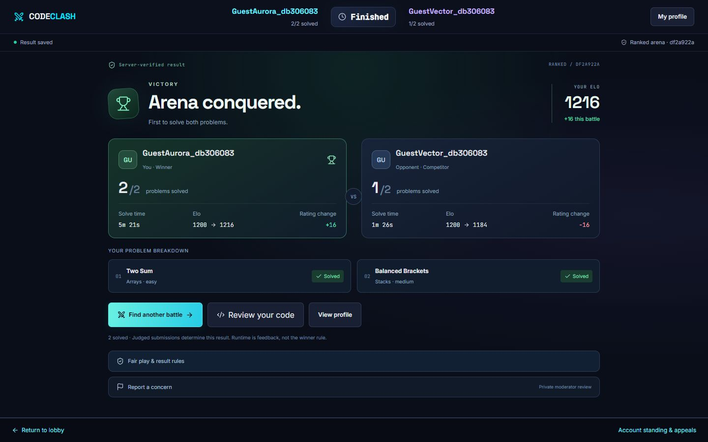
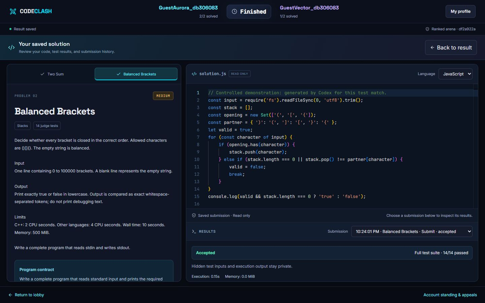

# Code Clash

A local application for real-time head-to-head coding battles. The React frontend uses Monaco, Zustand, and Socket.IO; the Express backend uses PostgreSQL/Prisma and Judge0 for sandbox code execution.

Authenticated, rating-based matchmaking is implemented. Players can cancel their queue and reconnect to the same live battle within a 30-second disconnect grace period. The rating search window starts at 100 points, widens by 50 every 15 seconds, and caps at 400; both players must qualify.

The ranked core now uses two shared problems, 30-minute durable deadlines, private-test Judge0 submissions, transactional Elo (K=32), reconnect recovery and persisted results. Profiles, achievements, rating charts, topic progress and the leaderboard read database records. Code similarity runs locally after official judging; AI authorship is explicitly not assessed.

See [implementation status and remaining work](docs/PROJECT_STATUS.md), plus the [profile preview](docs/profile-preview.jpg).

## Battle previews

The result screen shows the recorded winner, each player's solved problems, Elo changes, and a breakdown of your progress.



The coding arena pairs the problem statement with a themed Monaco editor and submission results. This screenshot shows the saved solution from the local test battle, with all 14 tests accepted.



## Prerequisites

- Node.js **24.13.1** recommended (recorded in `.nvmrc`); Node 22.12+ is also supported. Node 18 is too old for these dependencies.
- npm (provided with Node).
- Docker Desktop running **Linux containers** for local PostgreSQL and Judge0.

All commands below run from the repository root in PowerShell or another terminal.

## First-time setup

```sh
npm run setup
```

This installs the exact server/client dependencies using their committed lockfiles, creates missing `.env` files from the checked-in examples, generates a random local JWT secret, and generates Prisma Client. Re-running it preserves existing environment files and database connection settings. It does not modify your database or start containers.

Then start local services:

```sh
npm run infra:up
```

This starts two separate Compose projects:

| Service | Address | Purpose |
| --- | --- | --- |
| Application PostgreSQL | `localhost:5433` | Users, problems, and matches |
| Judge0 PostgreSQL | `localhost:5434` | Judge0's internal data (and the preserved database in older checkouts) |
| Judge0 API | `localhost:2358` | Code execution |

**Existing checkout:** setup preserves `server/.env`. If it already points at another database, review `DATABASE_URL` before the next command. To use the new local application database, use the URL in `server/.env.example`. Existing databases and Docker volumes are not migrated, reset, or deleted by setup.

Create/update the application tables, then start both development processes:

```sh
npm run db:push
npm run dev
```

`db:push` applies the current Prisma schema to your configured database. Prisma will require explicit intervention if it detects destructive changes; these scripts do not pass `--accept-data-loss`. A versioned SQL baseline is now available. New empty databases can use `npm run db:migrate` instead. For an existing database, first apply/verify the additive schema with `db:push`, then use `npm --prefix server run db:baseline` once before `db:migrate`. Never baseline a database whose schema has not been verified.

Open [Code Clash](http://localhost:5173). Use registration to create a local account. Open [the sandbox](http://localhost:5173/ide) to execute code. Judge0 may take additional time to initialize after its containers start.

In another terminal, verify the running services:

```sh
npm run doctor
```

Doctor checks the application database and expected tables, backend health endpoint, Judge0 language endpoint, and frontend response. It exits with a nonzero status if anything is unavailable. It performs no database writes. The backend `/health` endpoint confirms the HTTP process is alive; use doctor to check its dependencies.

## Daily development

After first-time setup:

```sh
npm run infra:up
npm run dev
```

Press Ctrl+C to stop both development processes. Containers persist until stopped:

```sh
npm run infra:down
```

Stopping containers preserves their database volumes.

## Commands

| Command | Purpose |
| --- | --- |
| `npm run setup` | Install locked dependencies, create missing local env files, generate Prisma Client |
| `npm run dev` | Run backend and frontend together |
| `npm run dev:server` | Run only the backend |
| `npm run dev:client` | Run only the frontend |
| `npm run check` | Run frontend lint and build both projects |
| `npm test` | Build and run queue, authenticated socket and local integrity tests |
| `npm run test:integration` | Real PostgreSQL battle/profile tests in a disposable database; requires database-create permission |
| `npm run db:migrate` | Apply checked-in SQL migrations to a new/baselined database |
| `npm run build` | Compile backend and produce frontend assets |
| `npm run db:generate` | Regenerate Prisma Client after schema edits |
| `npm run db:push` | Apply schema to the configured application database |
| `npm run doctor` | Check running services and database tables |
| `npm run infra:up` | Start application PostgreSQL and Judge0 containers |
| `npm run infra:down` | Stop containers without deleting volumes |

Built outputs are `server/dist` and `client/dist`. After a build, `npm --prefix server start` runs the compiled backend. `npm --prefix client run preview` previews frontend assets; it is not the development proxy setup. Set `VITE_API_URL` and `VITE_SOCKET_URL` before building if previewing against a separate backend.

## Code guide

| Path | Purpose |
| --- | --- |
| `client/src/pages/` | Account, battle, profile, leaderboard, and sandbox screens |
| `client/src/components/` | Editor, navigation, result, and report components |
| `server/src/index.ts` | API setup and Judge0 practice execution |
| `server/src/socket.ts` | Authenticated queue and live match events |
| `server/src/battles.ts` | Durable submissions and battle settlement |
| `server/prisma/` | Database schema and versioned migrations |
| `judge0/` | Local code execution configuration |

## Environment configuration

`server/.env.example` documents:

- `DATABASE_URL`: application PostgreSQL connection.
- `PORT`: backend port, default 5000.
- `JUDGE0_URL`: Judge0 API address, default `http://localhost:2358`.
- `JWT_SECRET`: required; setup generates a secret for local use.
- `CLIENT_ORIGINS`: comma-separated allowed frontend origins for HTTP and Socket.IO.

`client/.env.example` documents:

- `API_PROXY_TARGET`: backend address used by Vite, default `http://localhost:5000`.
- `VITE_API_URL`: optional direct API origin. Leave empty for the development proxy.
- `VITE_SOCKET_URL`: optional direct Socket.IO origin. Leave empty for the development proxy.

If changing the backend port, update both `PORT` and `API_PROXY_TARGET`. Restart development processes after environment changes. Vite uses port 5173 with `strictPort` so it fails clearly if occupied instead of silently moving to a different origin.

Environment files are ignored by Git. Local Compose credentials are intended for local development only. Judge0's existing privileged-container and cgroup compatibility setup is also for local development; production execution isolation needs separate review.

## Troubleshooting

- **Docker engine unavailable:** start Docker Desktop, wait for its Linux engine, then rerun `npm run infra:up`.
- **Port already occupied:** stop the conflicting service or update the Compose port and corresponding environment URL. Judge0's database is exposed on 5434; the application database uses 5433. Both use 5432 internally, without conflicting with a native PostgreSQL installation.
- **Older checkout using Judge0's database:** if your existing `codeclash` database lives in the Judge0 PostgreSQL volume, connect to port 5434 using that database's existing credentials. The new application database on 5433 is separate; setup does not migrate old data into it.
- **Database unavailable or missing tables:** check the preserved `DATABASE_URL`, start its PostgreSQL service, then run `npm run db:push`.
- **Judge0 unavailable:** run `docker compose -f judge0/judge0-v1.13.1/docker-compose.yml logs --tail 50 server workers`. The sandbox reports upstream errors instead of displaying an empty success result.
- **Backend missing JWT secret:** rerun `npm run setup`, or set a random secret in `server/.env`.
- **Dependency problems:** rerun `npm run setup`, then `npm run check`. Avoid deleting lockfiles or mixing package managers.

The old `test-matchmaking.cjs` files use unauthenticated prototype clients and are obsolete. Use `npm test` for the current matchmaking suite. Its temporary socket servers and database stub do not modify existing player data. The disposable PostgreSQL suite now verifies battle resolution and profile achievements. Run it with `npm run test:integration`. Real Judge0 verification also exercised full submissions in all assigned problems.

The original task plans remain in `docs/tasks` as design references. [PROJECT_STATUS.md](docs/PROJECT_STATUS.md) records delivered features, verification and the work remaining before deployment.

Monaco is copied from the locked npm package into ignored `client/public/monaco` assets during development/build, so the editor does not depend on a CDN. The build bounds compiler worker memory for laptop reliability. Code execution requires a signed-in account.
